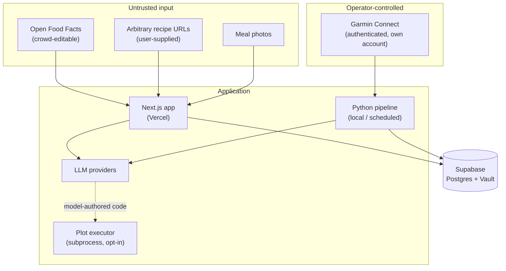

# Security

This document describes the deployment model this project assumes, the trust
boundaries in it, and the limitations that follow from those assumptions. It
exists because the system handles personal health data and a third-party account
password, and those deserve to be reasoned about explicitly rather than left
implicit in the code.

It is written against the code as it actually is, including the parts that are
weaker than they could be. Where something is unmitigated, it is listed as
unmitigated with the reason it is acceptable under the stated deployment model.

---

## Deployment model

**One operator, one tenant.** This is a personal training system built for a
single athlete. The only authenticated principal is the person who deployed it,
who is also the only data subject and the only administrator of the Supabase
project and Vercel deployment.

Everything below is evaluated against that assumption. Several accepted risks
would not be acceptable if a second, non-operator user existed — those are
called out individually, and summarised in
[Before adding a second user](#before-adding-a-second-user).

The project is open source so that others can read, learn from, or run it
themselves. It is not offered as a hosted service. Anyone self-hosting it
becomes the operator of their own deployment and inherits everything here.

---

## Reporting a vulnerability

Open a GitHub issue for anything that is not sensitive. For something that
should not be public — particularly anything affecting people who have
self-hosted this — use GitHub's private vulnerability reporting on this
repository instead.

This is a personal project maintained in spare time; there is no SLA. Expect a
response within a couple of weeks.

---

## Data handled

| Data | Where it lives | Notes |
|---|---|---|
| Health and training data (heart rate, HRV, sleep, weight, VO2max, activities) | Supabase Postgres | Special-category personal data under GDPR Art. 9 |
| Nutrition logs | Supabase Postgres | |
| Garmin Connect email and password | Supabase Vault (pgsodium), encrypted at rest | Reversibly encrypted — see [Garmin credential custody](#garmin-credential-custody) |
| Garmin OAuth tokens | Local filesystem, `~/.garminconnect` by default | Minted from the password; overridable via `GARMINCONNECT_TOKENS` / `GARTH_HOME` |
| LLM provider keys, Supabase service-role key | Environment variables (`.env`, Vercel project settings) | Never committed; `.env*` is gitignored |
| Prompts and model outputs | LLM provider; LangSmith when tracing is enabled | Contains health data — see [Data sent to third parties](#data-sent-to-third-parties) |

No payment data, no credentials belonging to anyone other than the operator, and
no data about third parties are stored.

---

## Trust boundaries

The boundary that matters most: **content from Open Food Facts and from
arbitrary recipe URLs is attacker-influenceable and reaches LLM prompts.** In
the opt-in plotting path, model output reaches a Python interpreter. Those two
facts are the source of most of what follows.

---

## What is enforced

These are properties the code actually maintains, not aspirations.

**Authentication.** All routes are gated by `web/proxy.ts`, which calls
Supabase's `getUser()` rather than `getSession()` — the latter trusts a cookie
the client can craft, while the former validates against the auth server on
every request. Unauthenticated requests are redirected to `/login` before any
page or API handler runs.

**Row-level security.** Every table created in `supabase/migrations/` has RLS
enabled with an owner policy of the form `auth.uid() = user_id`. See the
[service-role caveat](#authorization-depends-on-query-discipline-not-rls) for
where this is and is not the enforcing layer.

**Credential encryption at rest.** The Garmin password is stored via Supabase
Vault (pgsodium), not in a config file or a plain column. The
`store_garmin_credentials` / `get_garmin_credentials` functions are
`security definer` with `set search_path = public`, which prevents a caller from
hijacking name resolution inside the function body.

**Secret hygiene.** No secret has ever been committed — `.env*`, `data/`, and
the personal training config are gitignored, and the history is clean of key
material. `.env.example` contains placeholders only. The service-role key is
server-side exclusively and is never sent to the browser.

**Supply chain.** Dependencies are pinned and lockfiles (`pixi.lock`,
`web/package-lock.json`) are committed. CI runs ruff, mypy in strict mode,
the test suite, and a production Next.js build on every push and pull request.

**Sensitive-value logging.** Passwords and tokens are not logged. Garmin login
failures log the HTTP status and a truncated response body, not the credentials.

---

## Known limitations and accepted risks

### Garmin credential custody

Garmin Connect has no public OAuth flow for this use case, so the integration
authenticates with the account's real email and password (via `garth`, which
exchanges them for OAuth tokens cached on disk). The password must therefore be
recoverable in plaintext by the application, which rules out hashing — Vault
gives encryption at rest, not one-way storage.

*Accepted because* the only stored credential belongs to the operator, and the
blast radius of a compromise is the operator's own Garmin account.

*Not acceptable* for any deployment holding other people's Garmin passwords.
Doing that properly requires the official Garmin Connect Developer Program and
its OAuth flow, which would remove password custody entirely. **Do not run this
as a service for other people on the current design.**

### Model-authored code execution (opt-in, off by default)

When `enable_plotting: true`, the LLM emits Python as a tool-call argument and
`services/ai/tools/plotting/production_secure_executor.py` runs it via
`subprocess` with a 6-second timeout.

Despite the filename, **this is process isolation and a timeout, not a sandbox.**
The generated program template permits all imports; it does not restrict the
filesystem, network, or subprocess creation. Code the model is persuaded to
write will run with the privileges of the pipeline process — which include the
environment variables holding the Supabase service-role key.

*Accepted because* the feature is disabled by default, runs locally under the
operator, and the model's context in that path is the operator's own training
data.

*Mitigations if enabled:* run the pipeline with the narrowest possible
environment, and treat the feature as unsuitable for any deployment where prompt
content can be influenced by someone other than the operator. A container, a
restricted interpreter, or a dedicated execution service would be required to
make this safe generally.

### Untrusted content reaches LLM prompts

Recipe JSON-LD scraped from user-supplied URLs is interpolated directly into a
Claude prompt in `web/app/(app)/api/nutrition/meals/import-url/route.ts`, and
Open Food Facts entries are crowd-editable text that flows into the nutrition
pipeline. Either can carry instructions aimed at the model rather than data.

*Accepted because* the output of those calls is parsed as structured JSON with a
fixed schema and used only to populate nutrition fields, so a successful
injection corrupts the operator's own food log rather than crossing a privilege
boundary. There is no tool access in these prompts.

*Would need revisiting* if these paths ever gain tool use, write access beyond
the calling user's rows, or a shared prompt cache.

### Server-side fetch of arbitrary URLs (SSRF)

`POST /api/nutrition/meals/import-url` fetches a URL supplied in the request
body. It enforces an `http`/`https` protocol allowlist and a 10-second timeout,
and it sits behind the authenticated perimeter. It does **not** block private,
loopback, or link-local address ranges, and it does not restrict redirects — a
public URL can 302 to an internal address.

*Accepted because* the only party who can reach the endpoint is the operator,
and the deployment target is Vercel's serverless environment rather than a
network with internal services worth reaching.

*Before a second user:* add a DNS-resolution-time allowlist that rejects
private ranges, and re-check the destination on every redirect hop.

### Authorization depends on query discipline, not RLS

The Next.js app queries Supabase with the **service-role key**, which bypasses
RLS entirely, and scopes each query by hand with `.eq("user_id", uid)` — across
roughly 96 query sites. The Python pipeline does the same by design, since it
runs as a trusted backend with no user session.

RLS policies exist on every table, but for the web app they are dormant behind a
key that ignores them. Isolation therefore rests on every present and future
query remembering its filter, with no database-level backstop when one does not.

*Accepted because* there is exactly one user, so an unscoped query returns that
user's own rows.

*This is the single most important thing to fix before a second user exists.*
The correct shape is for the web app to use the anon key with the caller's
session so RLS is the enforcing layer, reserving the service-role key for the
Python backend.

### Auth enforced at one layer for outbound-proxy routes

Six API routes rely solely on `proxy.ts` for authentication rather than also
calling `getUserId()` in the handler: `generate-context`, `nutrition/barcode`,
`nutrition/food-details`, `nutrition/search`, `nutrition/vision`, and
`nutrition/meals/import-url`. These are the routes that call third-party and
paid LLM APIs without touching user rows. (`auth/callback` is unauthenticated by
design.)

*Accepted because* the proxy matcher covers all of them and no request reaches a
handler without a validated session.

*Worth noting* that a future change to the matcher would silently expose
outbound-request and paid-API endpoints, with no second check to catch it.
Calling `getUserId()` in these handlers would be cheap defence in depth.

### Data sent to third parties

Health data leaves the system in LLM prompts (Anthropic, OpenAI, or OpenRouter,
depending on configuration) and, when `LANGSMITH_API_KEY` is set, in traces sent
to LangSmith. Nutrition lookups query Open Food Facts and the USDA FoodData
Central API. Anyone self-hosting should decide deliberately whether those
providers are acceptable recipients of their health data, and leave LangSmith
tracing off unless they want prompt contents retained there.

### No automated dependency or secret scanning

CI runs linting, type checking, tests, and a build, but there is no Dependabot
configuration and no secret-scanning step. Dependency updates are manual.

---

## Before adding a second user

Consolidated, in the order it would need doing:

1. **Replace service-role queries in the web app** with session-scoped anon-key
   queries so RLS becomes the enforcing layer.
2. **Move Garmin authentication to the official Developer Program OAuth flow**
   and stop storing passwords altogether.
3. **Fix the SSRF** with a private-range blocklist applied at resolution time
   and on every redirect.
4. **Leave plotting disabled**, or move execution into a real sandbox.
5. **Add per-user authorization checks in the handlers**, not only in the proxy.
6. **Decide on a data-retention and deletion path** — GDPR Art. 9 data belonging
   to someone else carries obligations that a single-operator deployment does
   not.

Until at least items 1 and 2 are done, this should be run as a single-user
system only.
